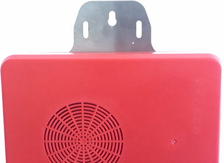

<!DOCTYPE html>
<html>
<head>
<meta charset="utf-8"> 
<title>新工地宝蓝牙网关用户手册</title> 

</head>

<body>
    
<h1 class="ex1">新工地宝蓝牙网关</h1>
<h1 class="ex2">用户手册</h1>
                      

北京弹弓科技有限公司

2020 年 2 月 4 号

</body>
</html>

## 产品概述
新工地宝蓝牙网关是针对定制的智能安全帽蓝牙标签进行采集定位的蓝牙智能网关设备，用于及时扫描上传智能安全帽的标签到服务器数据服务平台，实现对人员和资产进行区域定位和预警。设备集成蓝牙， 4G无线网络，音频播放等多种功能。

## 产品介绍

### 产品实物图片

### 产品参数

|项目|参数|备注|
|---|---|---|
|尺寸|197\*152\*55mm||
|颜色|红色||
|防水|内置防水圈，可防泼溅|| 
|供电方式|DC 12V 2A ||
|工作温度|-25℃ - 60℃||
|喇叭|内置10W||
|蓝牙规范|蓝牙4.1 协议||
|网络|4G-LTE （支持联通，移动）， 支持100M有线网线，支持LTE-TDD/LTE-FDD/TD-CDMA/UMTS/EDGE/GPRS/GSM||
|流量卡|内置联通流量卡||
|GPS|支持||
|天线|4G， GPS， 蓝牙天线内置||

### 产品功能

a)	蓝牙扫描iBeacon， 范围50-100米区域定位
b)	支持后台推送语音报警， 危险区域自动语音报警
c)	支持蓝牙iBeacon 白名单过滤
d)	支持远程无线升级
e)	指示灯状态

### 指示灯说明
|序号|丝印|说明|功能说明|备注|
|---|---|---|---|---|
|1|Power|电源指示灯|亮: 设备供电正常 灭: 设备没有供电或供电异常||
|2|Net|网络状态指示灯|亮: 网络通讯正常 灭: 网络无法通讯||
|3|BT|蓝牙状态指示灯|亮: 蓝牙工作正常 灭: 蓝牙工作异常||
|4|BAT|电池供电指示灯|亮: 电池供电 灭: 电源适配器供电||
|5|BAT|电池供电指示灯|亮: 电池供电 灭: 电源适配器供电||
|6|DEF|预留|无功能||
|7|4G|4G状态指示灯|快闪: 100ms亮,800ms灭 搜网状态 慢闪: 100ms亮,3000ms灭  注册成功 速闪: 100ms 亮,300ms灭  数据传输 关闭：飞行模式或关机状态||
	
### 按键指示说明

|序号|丝印|说明|功能说明|备注|
|---|---|---|---|---|
|1|V+|音量加|喇叭播放过程中，音量加||
|2|V-|音量减|喇叭播放过程中，音量减，直到静音||
|3|mode|模式切换键|无功能||
|4|K2|预留|无功能||
|5|K1|预留|无功能||
|6|Reset|设备重启键|设备重新运行||

## 产品安装
产品标配金属挂件和螺丝，工地宝根据现场状况，将工地宝与挂件一起固定到特定位置上， 并提供稳定的12V 电源。

## 售后服务

按照国家三包规定实行，一年内免费保修。