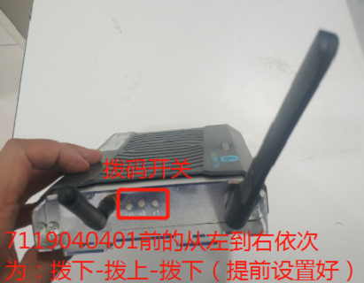
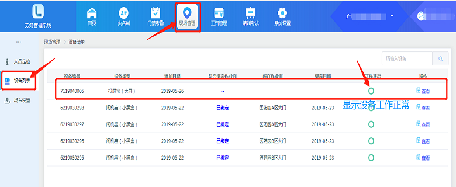

# 投屏宝安装指导手册

## 版本控制

|   版本    |   日期        |   撰写    |   更新说明             |   
|   ----    |   ----        |   ----    |  ----                |
|   V1.0    |   2019/10/8   |   赵小飞    |     |

## 安装说明

1. 安装时请确认长天线在上，短天线在下，如下图。（7119040400之后的设备只有一根天线）
 

2. 拨码开关从左到右依次是下-上-下，如下图所示。（7119040400之后的设备去除拨码开关）
 

3. 插入HDMI线，另一端连接电视HDMI口，在插入电源线前请确认已经将天线安装完毕，拨码开关拨到正确位置。
 

4. 开机后请确认投屏宝屏幕右下角显示的设备编号和投屏宝表面粘贴的设备编号一致。

## 平台显示

1. 在电脑端劳务系统里设置
 

2. 将每个闸机宝或者人脸设备绑定投屏宝：（绑定后，投屏宝就显示这个设备的数据）
在“现场管理”“设备列表”里，点击闸机宝或者人脸设备后面的“查看”按钮，进入设备详情界面。如下图：
 

注意的问题：
1、投屏宝只支持1080P的电视屏幕，即分辨率不低于1920*1080，低于此分辨率的大屏显示会有问题。
2、闸机宝和投屏宝之间，通过短距离的zigbee传输数据。所以闸机宝和投屏宝不能离的太远（一般在同一个门区）。投屏宝从云端抓取人脸设备上传的数据，所以，投屏宝和人脸设备之间没有距离限制。

