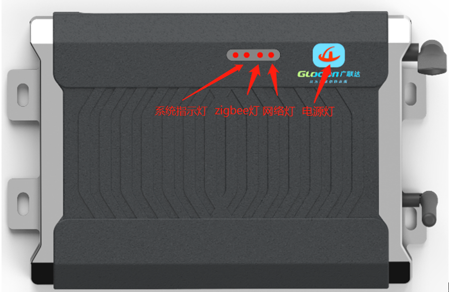

# 投屏宝规格说明书

## 版本控制

|   版本    |   日期        |   撰写    |   更新说明             |   
|   ----    |   ----        |   ----    |  ----                |
|   V1.0    |   2019/10/8   |   靳猛    |   更新led灯显示说明       |
|   V1.1    |   2019/10/14   |   靳猛    |   增加system led灯功能   |
|   V1.1    |   2019/12/20   |   靳猛    |   部分文字进行改动  |

## 产品参数

<table>
    <th colspan = 4>产品参数</th>
    <tr>
        <td>项目</td>
        <td>子项</td>
        <td>描述</td>
        <td>备注</td>
   </tr>
   <tr>
        <td rowspan = 4>基本规格</td>
        <td>品牌</td>
        <td>GLODON</td>
        <td>
   </tr>
   <tr>
        <td>型号</td>
        <td>MCC-WD-8F9B000002</td>
        <td>
   </tr>
   <tr>
        <td>颜色</td>
        <td>银灰色</td>
        <td>
   </tr>
   <tr>
        <td>外形尺寸</td>
        <td>205mm*142mm*36mm</td>
        <td>
   </tr>
   <tr>
        <td rowspan = 18>技术规格 设备支持</td>
        <td>电压范围</td>
        <td>9-28V</td>
        <td>
   </tr>
   <tr>
        <td>工作电压</td>
        <td>24V</td>
        <td>
   </tr>
   <tr>
        <td>zigbee</td>
        <td>透传模块</td>
        <td>7119040400之后产品不提供（除特殊定制）</td>
   </tr>
   <tr>
        <td>模组</td>
        <td>I.mx6qc 飞凌核心模组</td>
        <td>
   </tr>
      <tr>
        <td>RAM</td>
        <td>1G</td>
        <td>
   </tr>
   <tr>
        <td>ROM</td>
        <td>8G EMMC</td>
        <td>
   </tr>
   <tr>
        <td>显示</td>
        <td>LCD（RGB24）HDMI（1080P）</td>
        <td>
   </tr>
      <tr>
        <td>WIFI/BT</td>
        <td>WIFI/蓝牙 二合一方案</td>
        <td>
   </tr>
   <tr>
        <td>Ethernet</td>
        <td>100/1000M自适应</td>
        <td>
   </tr>
   <tr>
        <td>USB2.0</td>
        <td>2个，支持UVC 支持HID免驱</td>
        <td>
   </tr>
      <tr>
        <td>miniUSB</td>
        <td>OTG，固件烧录，app调试</td>
        <td>
   </tr>
   <tr>
        <td>HDMI</td>
        <td>1080P输出</td>
        <td>
   </tr>
   <tr>
        <td>AUDIO</td>
        <td>2路speaker（喇叭外接接口）1路耳机接口</td>
        <td>
   </tr>
      <tr>
        <td>摄像头</td>
        <td>罗技C270 USB摄像头 OV5640</td>
        <td>标准版不提供</td>
   </tr>
      <tr>
        <td>4g</td>
        <td>MINI PCIE 4g模组</td>
        <td>
   </tr>
   <tr>
        <td>LED灯</td>
        <td>见投屏宝正视图[1]</td>
        <td>
   </tr>
   <tr>
        <td>扩展模块</td>
        <td>支持硬件UART接口模组扩展</td>
        <td>
   </tr>
      <tr>
        <td>操作系统</td>
        <td>Android 4.4.2、Linux 3.0.35+QT4.8.5</td>
        <td>
   </tr>
   <th colspan = 4>APP端软件功能</th>
      <tr>
        <td rowspan = 5>APP功能</td>
        <td>搭载系统</td>
        <td>Android 4.4</td>
        <td>
   </tr>
   <tr>
        <td>实时显示</td>
        <td>人员进出实时显示当前人员的情况</td>
        <td>
   </tr>
   <tr>
        <td>现场实时分布</td>
        <td>动态更新施工现场人员分布情况</td>
        <td>
   </tr>
   <tr>
        <td>门禁考勤统计</td>
        <td>动态更新人员出勤统计</td>
        <td>
   </tr>
      <tr>
        <td>其他</td>
        <td>一些定制需求展示，统计等</td>
        <td>
   </tr>
   <tr>
        <td>国际认证</td>
        <td>认证 Standard</td>
        <td>
        <td>
   </tr>
    <th colspan = 4>配件</th>
      <tr>
        <td rowspan = 5>配件清单</td>
        <td>电源适配器</td>
        <td>数量*1</td>
        <td>
   </tr>
   <tr>
        <td>HDMI数据线</td>
        <td>数据线1.5m*1</td>
        <td>
   </tr>
   <tr>
        <td>天线</td>
        <td>4G天线*1 Zigbee天线*1</td>
        <td>7119040400之后产品只有4G天线（除特殊定制）</td>
   </tr>
</table>

## 投屏宝正视图

注[1]：当接入电源线时电源灯长亮；当系统正常启动后，系统指示灯会一直闪烁；当网络可用时投屏宝连接到MQTT时网络灯亮，并且人脸设备检测到有人进出时网络灯会闪烁一下；当zigbee模块正常启动后zigbee灯会亮，zigbee模块检测到有人进出时zigbee灯会闪烁一次（指示灯的功能是在设备号7119040201之后增加的,如果7119040400之后的产品不带zigbee模块的话zigbee指示灯会一直不亮）。