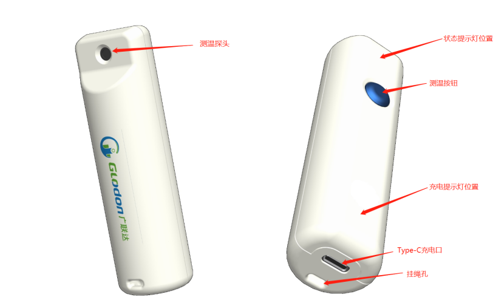
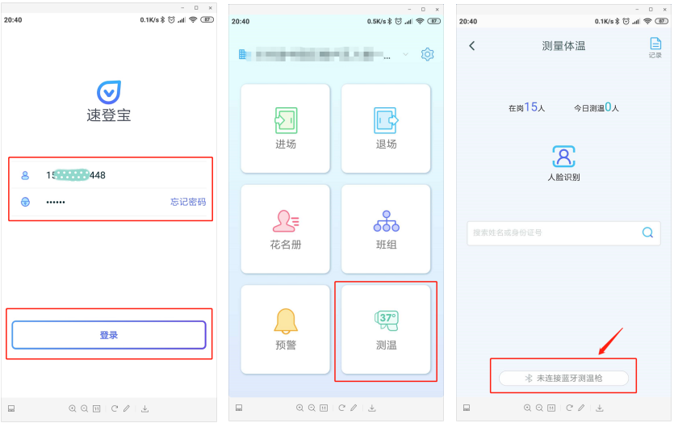
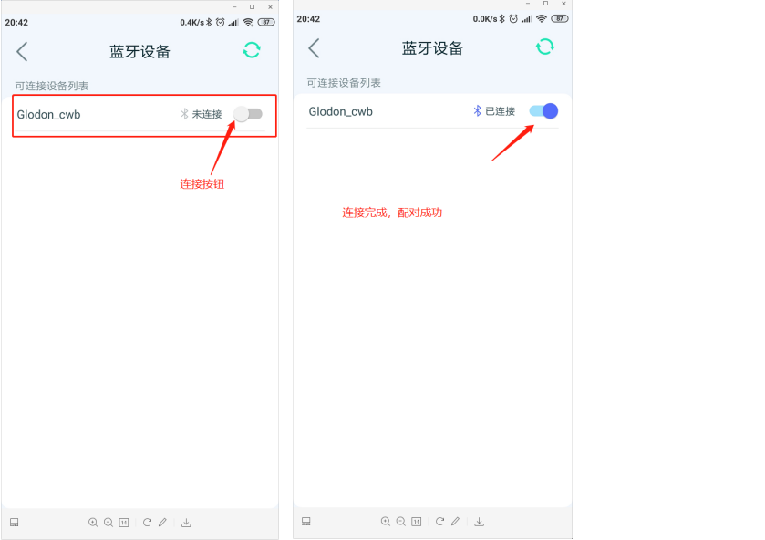
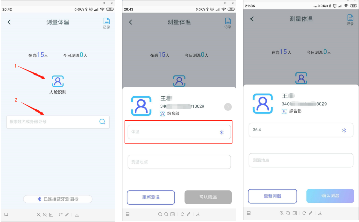

# 投屏宝规格说明书

## 版本控制

|版本|日期|撰写|更新说明|   
|---|---|---|---|
|V1.0|2020/03/12|杨鹏|首版|

## 介绍

本产品用于配合广联达速登宝APP进行快速采集体温数据与异常筛查。

## 展示

## 操作说明

### 手机App配对

登录速登宝App 选择测温模块测量体温界面，点击“未连接蓝牙测温枪”按钮

进入蓝牙设备界面，等待2 – 3秒钟，便可扫描到测温宝，如下图。点击链接按钮，链接过程开始启动。观察测温宝状态提示灯依次“红、绿、蓝”闪烁一次，表示配对完成。此时，APP链接按钮变为蓝色，配对过程完成。如下图所示。

### 正常测温

请确保手机配对成功后，在进行测温
手机配对完成后，点击返回，到达测量体温界面，如下图。
匹配工人信息途径：1、人脸识别，2、手动搜索工人姓名或身份证号。
匹配工人信息完成，自动跳转至温度采集界面，如下图。

#### 操作过程

* 手持测温宝，将测温探头放置在距离额头 2 – 4cm处
* 单击测温按钮，松开后，开始测温
* 在测试过程中，请保持测量位置1秒，观察到指示灯闪烁后再离开，测温完成
    - 绿灯“亮—灭”：表示体温正常
    - 黄灯“亮—灭”：表示体温异常
    - 红灯“亮—灭”：表示体温过高
    - 黄灯“闪烁3次”：表示测量人体温度异常（探头未对准额头，测量到空气温度），请重新测量
* 观察到闪灯提示后，测温结束，可以在APP测温界面查看准确温度数据，如前面图片演示

### 取消配对（测温宝取消）
* 手持测温宝，长按<b>测温按钮</b>超过3秒。
* 观察到<b>蓝灯“亮--灭”</b>，提示后，松开按钮。取消配对成功。

### 取消配对（速登宝APP取消）
* 方式一：终止速登宝APP，观察测温宝状态提示灯蓝灯“闪烁3次”，取消配对。
* 方式二：登录用户账户，进入到蓝牙设备界面（如下图），点击链接按钮，自动取消链接。观察测温宝状态提示灯蓝灯“闪烁3次”，取消配对。

## 特殊状态灯说明
* 低电量提醒。红灯“闪烁3次”。
* 测温异常提醒。黄灯“闪烁3次”
* 设备配对状态提醒。退出速登宝APP，连接自动断开，配对取消，蓝灯“闪烁3次”；长按测温按钮超过3秒，连接自动断开，配对取消，蓝灯“亮—灭”
* 连接Type-C 充电头后，自动充电。
    - 充电过程中，充电指示灯显示红色常亮。
    - 充电完成后，充电指示灯显示绿色常亮。
    - 拔出充电头后，充电指示灯灭。

## 使用注意事项
* 额头温度受环境温度影响较大，建议在室内使用。
* 测试过程中请尽量保持测试位置相对稳定，不要产生较大的晃动。
* 正常点击测温按钮，设备立刻进入测量状态，约0.5秒后，状态灯会有测量结果提示，用户使用过程中会有“延时”感觉，用户正常点击按钮即可，不需要长时间按住测温按钮。持续按键超过3秒，测温宝自动断开与APP连接，无法获取温度数据，还需要重新配对，建立连接，影响使用效率。
* 本产品支持Type-C接口充电，对功耗做了严格控制，满电状态下可持续工作3个月以上。单次充电1-2小时可充满。