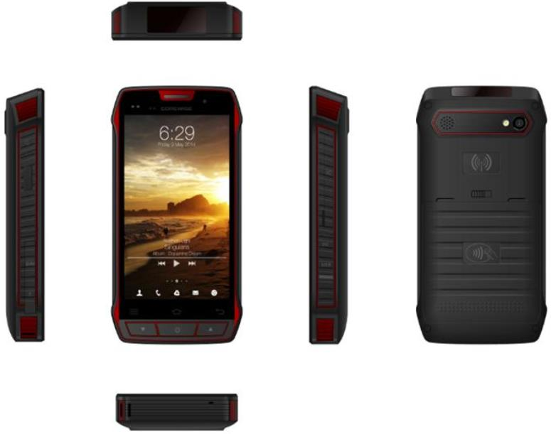

<b>U3 产品规格书</b>

 
- - - - 

<table>
    <tr>
        <td align="center"><b>产品名称</b></td>
        <td colspan = 3 align="center">智能手持终端</td>
        <td align="center"><b>产品型号</b></td>
        <td align="center">U3</td>
    </tr>
    <tr>
        <td align="center"><b>制定部门</b></td>
        <td align="center">项目组</td>
        <td align="center">版本</td>
        <td align="center">V1.0</td>
        <td align="center"><b>生效日期</b></td>
        <td align="center">2018.8.16</td>
    </tr>
</table>

<table>
    <tr bgcolor="#b0b0b0">
        <td align="center"><b>外观参数</b></td>
        <td align="center" ><b>4.3寸</b></td>
        <td align="center"><b>5.0寸</b></td>
    </tr>
    <tr>
        <td align="center">外观设计</td>
        <td align="center">直板</td>
        <td align="center">直板</td>
    </tr>
    <tr>
        <td align="center">物理按键</td>
        <td align="center">5 个（4 个主按键：电源键、功能键、音量+键、音量-键， 1 个侧按键：扫描键）</td>
        <td align="center">4 个（3 个主按键：电源、音量、音量-，侧按键：扫描键）</td>
    </tr>
    <tr>
        <td align="center">尺寸</td>
        <td align="center">156.8*79.5*22.2mm</td>
        <td align="center">156.8*79.5*22.2mm</td>
    </tr>
    <tr>
        <td align="center">重量</td>
        <td align="center">约400g</td>
        <td align="center">约400g</td>
    </tr>
    <tr>
        <td align="center">颜色</td>
        <td colspan = 2 align="center">黑色+红色</td>
    </tr>
    <tr bgcolor="#b0b0b0">
        <td align="center"><b>基本参数</b></td>
        <td align="center"><b>4.3寸</b></td>
        <td align="center"><b>5.0寸</b></td>
    </tr>
    <tr>
        <td align="center">操作系统</td>
        <td colspan = 2 align="center">Android 7.0</td>
    </tr>
    <tr>
        <td align="center">CPU</td>
        <td colspan = 2 align="center">Qualcomm Snapdragon MSM8953 八核 2.0G 主频</td>
    </tr>
    <tr>
        <td align="center">存储 （ram+rom）</td>
        <td colspan = 2 align="center">2GB RAM+16GB Flash(可定制 4GB RAM+32GB Flash 或 4GB RAM 64GB Flash)</td>
    </tr>
    <tr>
        <td align="center">显示</td>
        <td align="center">4.3 寸 高清 LCD ，分辨率 800*480</td>
        <td align="center">5 寸 高清 LCD ，分辨率 1280*720</td>
    </tr>
    <tr>
        <td align="center">触摸</td>
        <td align="center">电容式触摸屏， 支持多点触摸</td>
        <td align="center">电容式触摸屏， 支持多点触摸</td>
    </tr>
    <tr>
        <td align="center">充电/通讯接
    </td>
        <td colspan = 2 align="center">Type C 接口，支持 USB3.0， 高速传输， 支持防水,支持 OTG</td>
    </tr>
    <tr>
        <td align="center">相机</td>
        <td colspan = 2 align="left">前置： 800 万像素 ， 定焦 后置： 1600 万像素，相位自动对焦， 支持闪光灯</td>
    </tr>
    <tr>
        <td align="center">存储卡扩展</td>
        <td colspan = 2 align="center">支持 Micro SD 存储卡，最高支持至 128GB</td>
    </tr>
    <tr>
        <td align="center">SIM卡槽</td>
        <td colspan = 2 align="center">SIM1 卡槽， SIM2 卡槽（SIM 卡与 T-Flash 卡二选一）</td>
    </tr>
    <tr>
        <td align="center">PSAM卡</td>
        <td colspan = 2 align="center">支持 PSAM 卡 x 1</td>
    </tr>
    <tr>
        <td align="center">电池</td>
        <td align="left">内置不可拆卸锂电池， 3.8V, 容量 3800mAh（3 小时可充满）</td>
        <td align="left">内置不可拆卸锂电池， 3.8V, 容量 3800mAh（3 小时可充满）</td>
    </tr>
    <tr>
        <td align="center">续航能力</td>
        <td colspan = 2 align="left">持续工作大于 5 小时 屏亮待机大于 12 小时，休眠待机大于 500 小时</td>
    </tr>
    <tr>
        <td align="center">充电</td>
        <td colspan = 2 align="center">电源适配器支持高通 QC3.0 快速充电协议， 自适应 9V/2A,5V/3A， 最大功率可达 18W；</td>
    </tr>
    <tr>
        <td align="center">传感器</td>
        <td colspan = 2 align="center">支持重力传感器</td>
    </tr>
    <tr>
        <td align="center">扬声器</td>
        <td colspan = 2 align="center">支持， 内置单喇叭，</td>
    </tr>
    <tr>
        <td align="center">听筒</td>
        <td colspan = 2 align="center">支持， 内置</td>
    </tr>
    <tr>
        <td align="center">麦克风</td>
        <td colspan = 2 align="center">支持，内置 mic，</td>
    </tr>
    <tr>
        <td align="center">耳机</td>
        <td colspan = 2 align="center">支持， 3.5mm,支持线控</td>
    </tr>
    <tr>
        <td align="center">震动提示</td>
        <td colspan = 2 align="center">支持， 内置震动马达</td>
    </tr>
    <tr>
        <td align="center">通知方式</td>
        <td colspan = 2 align="center">震动，声音</td>
    </tr>
    <tr>
        <td align="center">可靠性</td>
        <td colspan = 2 align="center">平均无故障工作时间（MTBF）不小于 10000 小时</td>
    </tr>
    <tr bgcolor="#b0b0b0">
        <td colspan = 3 align="left"><b>通信功能</b></td>
    </tr>
    <tr>
        <td align="center">wifi</td>
        <td colspan = 2 align="center">内置 wifi 天线，双频 2.4G,5.8G， IEEE 802.11a/b/g/n/ac</td>
    </tr>
    <tr>
        <td align="center">蓝牙</td>
        <td colspan = 2 align="center">内置蓝牙天线， CLASS 2 功率， BT4.2 LE 标准</td>
    </tr>
    <tr>
        <td rowspan = 2 align="center">广域网</td>
        <td colspan = 2 align="left">配置一： LTE-FDD:B1/B3/B5/B8; <dd>&nbsp;&nbsp;&nbsp;&nbsp;&nbsp;&nbsp;LTE-TDD:B34/B38/B39/B40/B41; <dd>&nbsp;&nbsp;&nbsp;&nbsp;&nbsp;&nbsp;WCDMA:B1/B8; <dd>&nbsp;&nbsp;&nbsp;&nbsp;&nbsp;&nbsp;TD-SCDMA:B34/B39; <dd>&nbsp;&nbsp;&nbsp;&nbsp;&nbsp;&nbsp;CDMA:BCO; <dd>&nbsp;&nbsp;&nbsp;&nbsp;&nbsp;&nbsp;GSM:900/1800MHZ;</td>
    </tr>
    <tr>
        <td colspan = 2 align="left">配置二： LTE-FDD: B1/B3/B5/B7/B8/B20 <dd>&nbsp;&nbsp;&nbsp;&nbsp;&nbsp;&nbsp;LTE-TDD: B38/B39/B40/B41; <dd>&nbsp;&nbsp;&nbsp;&nbsp;&nbsp;&nbsp;WCDMA: B1/B5/B8 <dd>&nbsp;&nbsp;&nbsp;&nbsp;&nbsp;&nbsp;GSM:850/900/1800/1900MHZ</td>
    </tr>
    <tr>
        <td align="center">GPS</td>
        <td colspan = 2 align="center">集成 GPS， 北斗、 GLONASS， 精度 8m， 内置天线</td>
    </tr>
    <tr bgcolor="#b0b0b0">
        <td colspan = 3 align="left"><b>扩展功能</b></td>
    </tr>
    <tr>
        <td align="center">NFC传输</td>
        <td colspan = 2 align="left">标配，内置天线； NXP pn548 芯片， 支持 ISO/IEC 14443 A、 ISO/IEC 14443 B，Mifare•one•S50， S70， 识别距离0-5cm，根据标签类型有关</td>
    </tr>
    <tr>
        <td align="center">扫描识别</td>
        <td colspan = 2 align="center">霍尼 3680 扫码头，支持条码类型：支持 Aztec Code, Codabar, Codablock F, Code 11,Code 16K, Code 128, Code 2 of 5, Code 39, Code 49, Code 93, Data Matrix, EAN/JAN-13,EAN/JAN 8, EAN-UCC Composite Codes, EAN-UCC Emulation, ATA Code 2 of 5,Interleaved 2 of 5, Matrix 2 of 5, MaxiCode, MicroPDF417, MSI, PDF417, Postal Codes(Australian Post, British Post, Canadian Post, china Post, Japanese Post, KoreaPost, Netherlands Post, Planet Code, Postnet), Plessey Code, PosiCode, QR Code,RSS Expanded, RSS Limited, RSS-14, TCIF Linked Code 39, Telepen, Trioptic Code,UPC-A, UPC E</td>
    </tr>
    <tr>
        <td align="center">指纹识别</td>
        <td align="center">电容按压式，分辨率 508dpi，支持中国公安部认证算法，国际 FBI 标准认证算法，印度 STQC 标准认证算法； 兼容多种类型指纹模组</td>
        <td align="center">不支持</td>
    </tr>
    <tr>
        <td align="center">二代证</td>
        <td colspan = 2 align="center">可选， 内置身份证模块</td>
    </tr>
    <tr>
        <td align="center">超高频</td>
        <td colspan = 2 align="center">可选， 内置超高频模块， 采用 LUM9200X03 模块， 天线内置</td>
    </tr>
    <tr bgcolor="#b0b0b0">
        <td colspan = 3 align="left"><b>工作环境</b></td>
    </tr>
    <tr>
        <td align="center">工作温度</td>
        <td colspan = 2 align="center">10℃～+50℃</td>
    </tr>
    <tr>
        <td align="center">储运温度</td>
        <td colspan = 2 align="center">-20℃～+70℃</td>
    </tr>
    <tr>
        <td align="center">工作湿度</td>
        <td colspan = 2 align="center">&lt;90％RH</td>
    </tr>
    <tr>
        <td align="center">储运湿度</td>
        <td colspan = 2 align="center">20％ ～93％RH(40℃)</td>
    </tr>
    <tr>
        <td align="center">大气压力</td>
        <td colspan = 2 align="center">86Kpa～110Kpa</td>
    </tr>
    <tr bgcolor="#b0b0b0">
        <td colspan = 3 align="left"><b>配件</b></td>
    </tr>
    <tr>
        <td align="center">数据线</td>
        <td colspan = 2 align="center">USB3.0</td>
    </tr>
    <tr>
        <td align="center">充电器</td>
        <td colspan = 2 align="center">国标，欧标,美标，英标</td>
    </tr>
    <tr>
        <td align="center">附件</td>
        <td colspan = 2 align="center">说明书，保修卡/合格证</td>
    </tr>
</table>
 

    说明： 本型号机器可根据具体需求定制不同配置 <dd>&nbsp;&nbsp;&nbsp;本规格书若与实际物品有差异，请以实物为准

 

    咨询热线： 139-1075-9056 网址：
    <a href="http://www.corewise.cn/" target="_blank" title="http://www.corewise.cn/">www.corewise.cn</a>
     
    公司地址：南京市汉中门大街 301 号国际服务外包大厦 1 栋 5 楼

    

- - - - 

<b>南京肯麦思智能技术有限公司</b>

