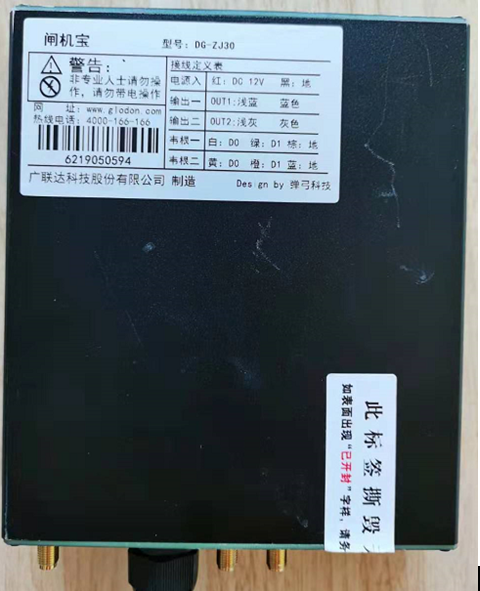

<!DOCTYPE html>
<html>
<head>
<meta charset="utf-8"> 
<title>闸机宝控制器产品说明书</title> 

</head>

<body>
    
<h1 class="ex1">闸机宝控制器</h1>
<h1 class="ex2">用户手册</h1>
                      

北京弹弓科技有限公司

2020 年 2 月 4 号

</body>
</html>

## 产品概述
闸机宝控制器一款是针对道闸，翼闸，辊闸，全高闸等闸机开关控制的专用设备，该控制器支持标准的韦根26 协议，支持RFID标签无感开闸， 支持IC卡等多种方式打开闸机门，同时可以将刷卡考勤数据通过4G或LAN 传输给指定的云管理平台中心。

## 产品介绍

### 产品实物图片

### 产品参数

|项目|参数|备注|
|---|---|---|
|尺寸|150\*132\*39mm||
|颜色|黑色|| 
|供电方式|DC 12V—24V 2A ||
|工作温度|-25℃ - 60℃||
|网络|4G-LTE （支持联通，移动）， 支持100M有线网线，支持LTE-TDD/LTE-FDD/TD-CDMA/UMTS/EDGE/GPRS/GSM||
|流量卡|内置联通流量卡||
|UHF RFID工作频率|840~960Mhz||
|支持协议|EPC GEN2 / ISO 18000-6C||
|最大射频输出功率|+30dBm （1W）||
|天线|UHF 天线外置， 4G天线外置||
|信号输入|支持2路韦根输入， 2路UART输入||
|闸机控制输出|支持 2路开关量输出， 2路韦根输出||
|RFID 读卡|支持2路RFID读头||

### 产品功能

a)	支持远程无线升级
b)	支持UHF 无感开闸机
c)	支持韦根协议的人脸设备开闸
d)	支持IC卡开闸
e)	指示灯状态

### 指示灯说明
|序号|丝印|说明|功能说明|备注|
|---|---|---|---|---|
|1|Power|电源指示灯|亮: 设备供电正常 灭: 设备没有供电或供电异常||
|2|RFID|RFID状态指示灯|亮: RFID模块正常 灭: RFID模块异常||
|3|SYS|网络状态指示灯|亮: 4G网络正常 灭: 网络无法联通||
|4|RUN|预留指示灯|灭：正常||

## 产品安装
|线|标识|功能说明|备注|
|---|---|---|---|
|电源|红： 12V或24V 黑： 地|控制器电源输入||
|韦根一|出门信号|若对接指定的WG2052 板， 则将韦根一端子接入到WG2052 板子的出门信号口即可， 无需接开关量输出一||
|韦根二|进门信号|若对接指定的WG2052 板， 则将韦根二端子接入到WG2052 板子的进门信号口即可， 无需接开关量输出一||
|开关量输出一|出门开闸信号|若不接入劳务实名制的大屏， 或接入第三方闸机的话， 则将此开关量输出一的2根线接入到闸机的出门开闸信号口即可||
|开关量输出二|进门开闸信号|若不接入劳务实名制的大屏， 或接入第三方闸机的话， 则将此开关量输出二的2根线接入到闸机的进门开闸信号口即可||
|开关量输出三|预留|||
|开关量输出四|预留|||
|馈线口|端口1：出门馈线接口 端口2：进门馈线接口|馈线要直接连接到RFID的天线||
|4G接口|4G天线接口|外置4G天线，确保网络正常||

**根据以上线序安装到对应的闸机主板上**

## 售后服务

按照国家三包规定实行，一年内免费保修。